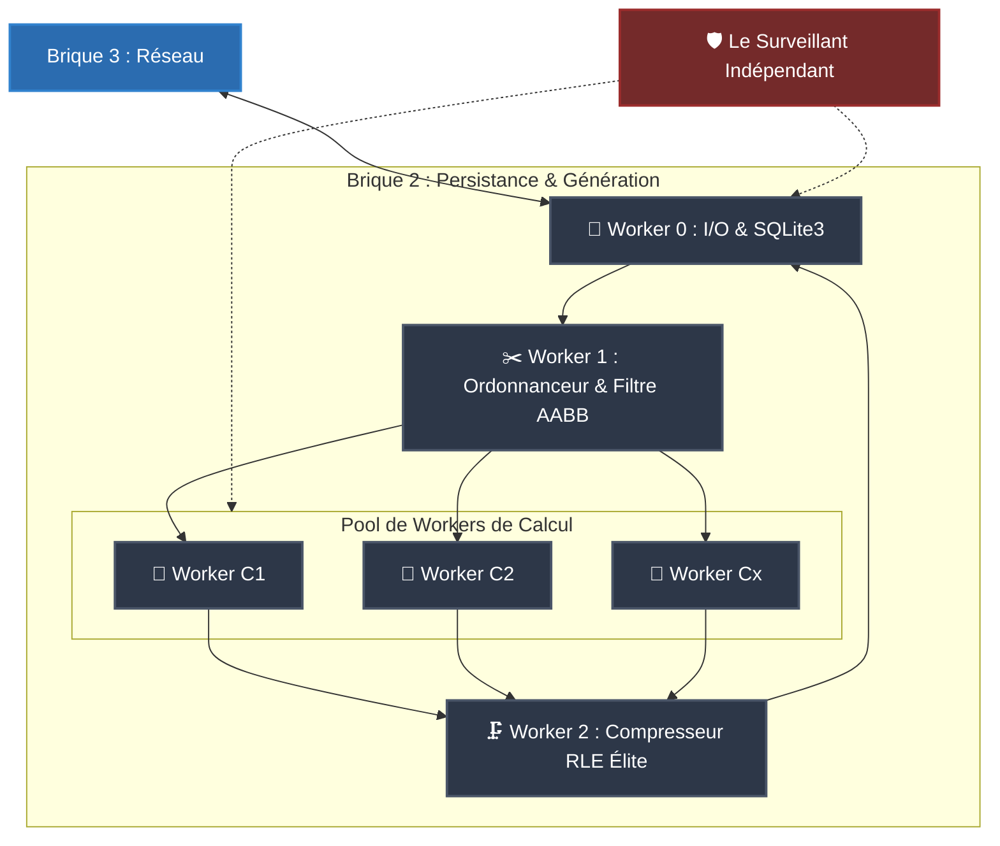

# 📊 Diagramme de Flux et Architecture Mémoire — Brique 2 (V2.1)

    
## 📌 Légende Technique des Flux de Données

1. **Ligne descendante (Entrée de Tâches) :** Requêtes réseau légères FlatBuffers $\rightarrow$ Métadonnées SQLite lues par paquets $\rightarrow$ Découpe en structures atomiques `NanoJob` de 64 octets alignées pour le cache.
    
2. **Zone de Turbulence Calcul (Pool) :** Isolation complète. Les données voxel brutes ne naissent et ne transitent que dans les lignes de **Cache L1/L2 des cœurs CPU** ($> 1\text{ To/s}$). La RAM principale n'est jamais polluée par des matrices brutes non compressées.
    
3. **Ligne ascendante (Sortie Réseau) :** Le compresseur écrase le superflu $\rightarrow$ Seul le fluide binaire RLE compact est persisté dans le cache RAM global et streamé sur le réseau par la Brique 3.
    
4. **Le Cadre Externe (Surveillant) :** N'interfère jamais avec la mémoire des workers pendant qu'ils calculent. Il agit de manière asynchrone sur l'OS (`ramdisk`, fichiers, signaux de threads, auto-scaling de la pool).